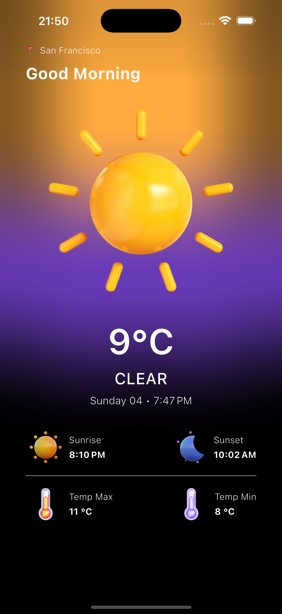

# 🌤️ Weather App

A simple Flutter app that shows the current weather based on the user's location using the OpenWeather API.

## 🔧 Core Technologies

- Flutter
- BLoC (state management)
- geolocator
- weather
- flutter_bloc

## 🌐 API

- [OpenWeather](https://openweathermap.org/) – used to fetch real-time weather data

## ▶️ Getting Started

1. Install dependencies:
   ```bash
   flutter pub get

<p align="center">
  
</p>

